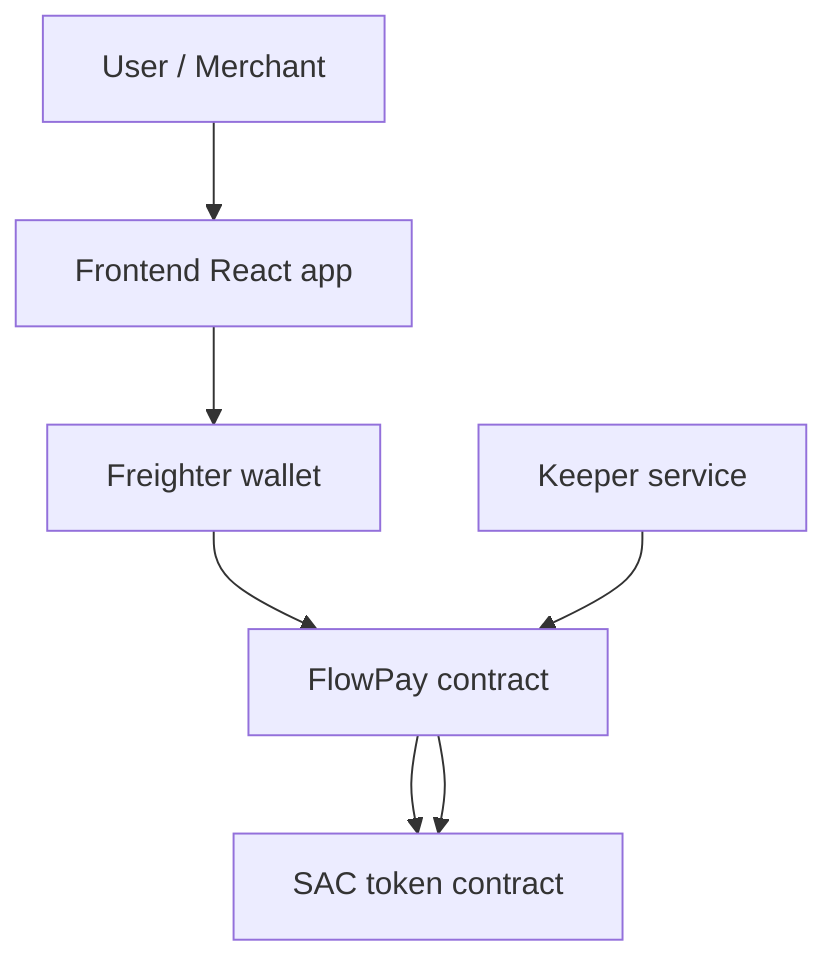

# Architecture

This document describes the current FlowPay contract architecture, module responsibilities, storage layout, event flow, and frontend integration.

---

## System Overview

FlowPay has two runtime pieces:

1. The Soroban contract in `contract/src/`, which owns subscription state and all on-chain policy.
2. The React frontend in `frontend/`, which builds transactions and submits them through Freighter.

A [keeper](./GLOSSARY.md#keeper) process is the only off-chain service required for recurring billing. It calls `charge()` or `batch_charge()` on schedule.

---

## Contract Modules

| Module | Responsibility |
| --- | --- |
| `lib.rs` | Public entry points, contract data types, storage keys, and cross-module orchestration. |
| `admin.rs` | Admin initialization, auth checks, and two-step admin transfer. |
| `batch.rs` | `batch_charge()` processing and per-user result reporting. |
| `bench.rs` | Benchmark-only instruction counting for core flows. |
| `charge_exec.rs` | Charge scheduling helpers and charge execution internals. |
| `errors.rs` | Contract error codes. |
| `events.rs` | All event emission helpers. |
| `fee.rs` | Protocol fee proposal, commit, and fee calculation logic. |
| `grace.rs` | Grace-period proposal, commit, and lookup helpers. |
| `merchant_stats.rs` | Merchant revenue, subscriber counts, and daily revenue buckets. |
| `migration.rs` | Schema version tracking and storage migration. |
| `min_interval.rs` | Minimum billing interval floor. |
| `referral.rs` | Referral storage and lookup. |
| `spending_limit.rs` | Temporary daily spending limits for `pay_per_use()`. |
| `storage.rs` | Shared storage read/write helpers. |
| `subscription_count.rs` | Active subscription count and append-only subscriber index. |
| `subscription_history.rs` | Charge history recording and paging. |
| `subscription_metadata.rs` | Short subscription labels. |
| `test.rs` | Contract unit tests. |
| `trial.rs` | Trial end computation and trial helpers. |
| `upgrade.rs` | WASM upgrade wrapper and upgrade event emission. |
| `validation.rs` | Shared validation helpers for amounts, intervals, and allowance checks. |
| `whitelist.rs` | Merchant whitelist and freeze state helpers. |

---

## Data Flow

### Subscription creation

1. `subscribe()` or `subscribe_with_metadata()` validates auth, whitelist state, minimum interval, and token allowance.
2. `storage.rs` writes the `Subscription` record.
3. `subscription_count.rs` updates the active count and subscriber index when needed.
4. `referral.rs` stores an optional referrer.
5. `subscription_metadata.rs` stores an optional label for the metadata path.
6. `events.rs` emits the subscription event.

### Recurring charge

1. `charge()` loads the subscription and checks pause, interval, and grace period state.
2. `fee.rs` calculates any protocol fee split.
3. The token contract performs `transfer_from()`.
4. `merchant_stats.rs` records merchant revenue.
5. `subscription_history.rs` records the successful charge timestamp.
6. `events.rs` emits `charged`.

### Batch charge

1. `batch_charge()` iterates over a list of subscriber addresses.
2. `batch.rs` reuses the same charge eligibility checks as the single-charge path.
3. Each user produces a `ChargeResult` instead of aborting the whole transaction.

### Merchant analytics

1. `merchant_stats.rs` stores cumulative revenue and daily revenue buckets.
2. Read helpers expose total revenue, per-day revenue, and subscriber counts.
3. Administrative reset helpers clear or zero selected counters without affecting subscription state.

### Metadata and history

1. `subscription_metadata.rs` stores short labels.
2. `subscription_history.rs` stores charge timestamps and supports paging and clearing.
3. `referral.rs` stores the original referrer, if any.

---

## Storage Strategy

FlowPay uses Soroban instance, persistent, and temporary storage deliberately.

| DataKey | Purpose | Storage type |
| --- | --- | --- |
| `Token` | Default payment token | instance |
| `Admin` | Current admin | instance |
| `PendingAdmin` | Two-step admin transfer target | instance |
| `ContractPaused` | Global pause flag | instance |
| `GracePeriod` | Charge grace window | instance |
| `WhitelistEnabled` | Merchant whitelist flag | instance |
| `FeeCollector` / `FeeBps` | Protocol fee configuration | instance |
| `PendingFee` | Pending fee proposal | temporary |
| `PendingGracePeriod` | Pending grace-period proposal | temporary |
| `MinInterval` | Minimum allowed subscription interval | instance |
| `SchemaVersion` | Storage schema version | instance |
| `ActiveCount` | Active subscription count | instance |
| `SubscriberIndexSize` | Append-only subscriber count | instance |
| `Subscription(user)` | Subscriber subscription record | persistent |
| `MerchantWhitelist(merchant)` | Whitelisted merchant flag | persistent |
| `MerchantFrozen(merchant)` | Frozen merchant flag | persistent |
| `MerchantRevenue(merchant)` | Cumulative merchant revenue | persistent |
| `MerchantRevenueDay(merchant, day)` | Daily revenue bucket | persistent |
| `MerchantRevenueHistory(merchant)` | History vector for revenue reads | persistent |
| `MerchantSubCount(merchant)` | Active subscriber count per merchant | persistent |
| `DailyLimit(user)` | Temporary pay-per-use limit | temporary |
| `DailySpent(user)` | Temporary pay-per-use spend counter | temporary |
| `Referral(user)` | Referrer for a subscriber | persistent |
| `SubscriptionMeta(user)` | Short subscription label | persistent |
| `ChargeHistory(user)` | Charge timestamps | persistent |
| `SubscriberIndex(i)` | Append-only subscriber list entry | persistent |
| `GlobalVolumeWindow` | Rolling volume cap state | instance |

Persistent entries that must remain available are refreshed with TTL extensions where needed, most importantly subscription records and selected merchant-revenue data. Temporary entries are used for short-lived proposals and daily spending caps.

---

## Event Architecture

Events are emitted from `events.rs` and kept separate from storage mutation so the public contract methods remain small.

| Event | Trigger |
| --- | --- |
| `subscribed` | New or replaced subscription created |
| `charged` | Successful recurring charge |
| `pay_per_use` | Successful one-time charge |
| `cancelled` | Subscription cancelled |
| `paused` / `resumed` | Subscription pause state changed |
| `admin_transferred` | Two-step admin transfer completed |
| `fee_proposed` / `fee_committed` | Fee configuration changed |
| `merchant_added` / `merchant_removed` | Whitelist updated |
| `merchant_frozen` / `merchant_unfrozen` | Merchant freeze state changed |
| `grace_period_proposed` / `grace_period_committed` | Grace period updated |
| `subscription_amount_updated` / `subscription_interval_updated` | Admin adjusted a subscription |
| `merchant_withdrawal` | Merchant withdrew revenue |
| `daily_limit_set` / `daily_limit_removed` | Daily limit updated |
| `subscription_transferred` | Subscription ownership moved |
| `upgraded` | Contract WASM upgraded |

Events are the main off-chain integration surface for analytics, indexers, and the keeper workflow.

---

## Frontend Interaction

The frontend does not talk to the contract directly. `frontend/src/stellar.ts` builds and simulates Soroban transactions, then Freighter signs them.

Typical flows:

- Subscribe: build transaction, simulate, sign, submit.
- Charge or pay-per-use: same transaction pipeline, but the user or keeper supplies the target address.
- Dashboard reads: call read-only entry points like `get_subscription()`, `get_protocol_stats()`, and `get_charge_history()`.

The frontend is intentionally thin. It should remain a transaction builder and state viewer, not a source of business logic.

---

## Benchmarks

`contract/src/bench.rs` contains instruction-count benchmarks for `subscribe()`, `charge()`, `pay_per_use()`, and a 10-user `batch_charge()` scenario. These are separate from unit tests and should be used to catch cost regressions.

The benchmark file prints CPU and memory costs at runtime and compares them against budget thresholds. If a change increases cost intentionally, update both the printed baseline comment and the threshold constant together.
