# Storage and TTL Management Architecture

This document details the storage architecture and Time-to-Live (TTL) management strategy for FlowPay. 

Stellar's Soroban smart contract platform utilizes state archiving to limit ledger growth. To prevent contract data from being deleted (archived) by the network, developers must understand and systematically manage state expiration boundaries.

---

## 1. Soroban Storage Tiers

FlowPay utilizes all three storage tiers provided by the Soroban runtime. Each serves a specific purpose and lifecycle within the protocol.

| Storage Tier | Lifecycle | Behavior when Expired | Protocol Use Case |
| :--- | :--- | :--- | :--- |
| **Instance** | Tied to the contract bytecode deployment. | The entire contract becomes unusable until the instance TTL is bumped. | Global configuration parameters, admin settings, and contract-wide counters. |
| **Persistent** | Independent lifecycle per key. | Data is archived (evicted) but can be restored by paying a restoration fee. | Critical, long-term state that must never be permanently lost (e.g., active user subscriptions). |
| **Temporary** | Independent lifecycle per key. | Data is permanently deleted. Cannot be restored. | Ephemeral state that resets automatically (e.g., daily spending limits). |

---

## 2. DataKey Mapping Reference

All keys defined in the `DataKey` enum (`contract/src/lib.rs`) are mapped below to their designated storage scope.

```mermaid
graph TD
    DataKey[DataKey Enum] --> Instance[Instance Storage]
    DataKey --> Persistent[Persistent Storage]
    DataKey --> Temporary[Temporary Storage]

    subgraph Instance Keys
        Instance --> Token[Token]
        Instance --> Admin[Admin]
        Instance --> GracePeriod[GracePeriod]
        Instance --> WhitelistEnabled[WhitelistEnabled]
        Instance --> FeeCollector[FeeCollector]
        Instance --> FeeBps[FeeBps]
        Instance --> ActiveCount[ActiveCount]
        Instance --> SchemaVersion[SchemaVersion]
    end

    subgraph Persistent Keys
        Persistent --> Subscription[Subscription Address]
        Persistent --> MerchantWhitelist[MerchantWhitelist Address]
        Persistent --> MerchantRevenue[MerchantRevenue Address]
        Persistent --> Referral[Referral Address]
        Persistent --> SubscriptionMeta[SubscriptionMeta Address]
        Persistent --> ChargeHistory[ChargeHistory Address]
    end

    subgraph Temporary Keys
        Temporary --> DailyLimit[DailyLimit Address]
        Temporary --> DailySpent[DailySpent Address]
    end
```



### Detailed Mapping Table

| DataKey Variant | Storage Type | Read/Write Frequency | Purpose |
| :--- | :--- | :--- | :--- |
| `DataKey::Token` | **Instance** | Rare (write at init, read on setup) | Address of the accepted payment token (SAC / XLM). |
| `DataKey::Admin` | **Instance** | Low (write on upgrade, read on auth check) | Admin address for configuration functions. |
| `DataKey::GracePeriod` | **Instance** | Low (read during charge check) | Period (in seconds) that a subscription charge can be delayed. |
| `DataKey::WhitelistEnabled` | **Instance** | Low (read during subscribe flow) | Flag indicating if the merchant whitelist is active. |
| `DataKey::FeeCollector` | **Instance** | Low (read during charge/fee routing) | Address receiving protocol service fees. |
| `DataKey::FeeBps` | **Instance** | Low (read during charge/fee routing) | Protocol fee in basis points (1 bp = 0.01%). |
| `DataKey::ActiveCount` | **Instance** | High (written on subscribe/cancel) | Total number of currently active subscriptions. |
| `DataKey::SchemaVersion` | **Instance** | Rare (read/written on state migration) | Current schema version for safe contract migration. |
| `DataKey::Subscription(Address)` | **Persistent** | High (read/written on subscribe, charge, cancel) | The core `Subscription` struct for a user. |
| `DataKey::MerchantWhitelist(Address)`| **Persistent** | Low (read on subscribe, write on admin update) | Boolean whitelist flag per merchant address. |
| `DataKey::MerchantRevenue(Address)` | **Persistent** | Medium (written on successful charge) | Running total revenue (i128) received by a merchant. |
| `DataKey::Referral(Address)` | **Persistent** | Low (written on subscribe, read on check) | The referrer address associated with a subscriber. |
| `DataKey::SubscriptionMeta(Address)` | **Persistent** | Low (written/read on user request) | Custom label/name for a user's subscription plan. |
| `DataKey::ChargeHistory(Address)` | **Persistent** | Medium (written on charge, read on query) | A rolling vector of the last 12 charge timestamps. |
| `DataKey::DailyLimit(Address)` | **Temporary** | Medium (written/read on spending limit change) | Daily limit cap (i128) for `pay_per_use` transactions. |
| `DataKey::DailySpent(Address)` | **Temporary** | Medium (written/read on `pay_per_use` calls) | Accumulated spent amount (i128) for the current window. |

---

## 3. TTL and Extension Strategy

To avoid state eviction, FlowPay proactively manages TTL boundaries through threshold-based extensions.

### Ledger Threshold Parameters

Stellar ledgers close approximately every **5 seconds**. 

| Storage Category | Target TTL (Ledgers) | Target TTL (Time) | Bumping Trigger / Mechanism |
| :--- | :--- | :--- | :--- |
| **Instance Storage** | Network Default | Same as Contract | Automatically bumped when the contract is interacted with. No manual extension of instance keys is coded in the contract logic. |
| **Persistent Storage** | `6,307,200` | ~1 Year | Explicitly extended during user actions (e.g., creation, charge, or manual extension). |
| **Temporary Storage** | `17,280` | ~24 Hours | Reset/extended on daily limit configuration and each daily spend transaction. |

---

## 4. Implementation Details

### Persistent Storage Extension
During critical user interactions, the contract invokes the internal helper function `extend_subscription_ttl`:
```rust
fn extend_subscription_ttl(env: &Env, user: &Address) {
    env.storage().persistent().extend_ttl(
        &DataKey::Subscription(user.clone()),
        SUBSCRIPTION_TTL_LEDGERS, // 6,307,200 ledgers (~1 year)
        SUBSCRIPTION_TTL_LEDGERS, // 6,307,200 ledgers (~1 year)
    );
}
```
This is called during:
* `subscribe()`: Extends the key's TTL upon creation.
* `charge()`: Extends the key's TTL each time a billing interval elapses and the user is charged.
* `extend_subscription_ttl()`: A public contract entrypoint enabling external keepers or users to manually trigger a TTL bump.

### Temporary Storage Extension
Daily spending limits and tracking variables are placed in temporary storage. Their TTL is extended to exactly 1 day (`17,280` ledgers) on modification/access:
```rust
const LEDGERS_PER_DAY: u32 = 17_280;

pub fn set_daily_limit(env: &Env, user: &Address, limit: i128) {
    let key = DataKey::DailyLimit(user.clone());
    env.storage().temporary().set(&key, &limit);
    env.storage()
        .temporary()
        .extend_ttl(&key, LEDGERS_PER_DAY, LEDGERS_PER_DAY);
}
```
Once `17,280` ledgers pass without updates, these keys are permanently purged. This avoids accumulating dead user state over time.

---

> [!NOTE]
> Keepers and protocol integrators should monitor the TTL of active subscriptions and call `extend_subscription_ttl` manually if a subscription is paused/idle for an extended period, preventing it from falling into archived state.
